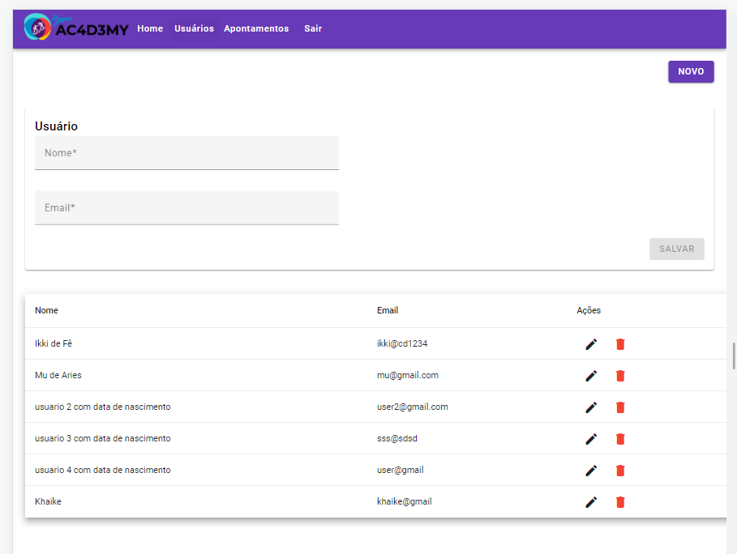

# Projeto Angular consumo de APIS 💳

Repositório de estudo sobre o Angular 16 e consumo de API, desenvolvido em aulas para o projeto Kaspper Academy - Turma 2/2023.

O Projeto possui uma página de login, home e usuários. Utiliza o HTTP Client  do Angular para lidar com requisições HTTP, além de Reactive Forms para trabalhar com formulários de modo reativo. Possui um CRUD para uma API de usuários implementada utilizando o SPRING BOOT em Java.

    <kbd>
        
    </kbd>

## 📚 Tecnologias

- Angular 16
- Angular Material
- Sweetalert

## 🎁 Features

-  **HTTP Client** e **Observables**  para requisições HTTP;
- Componentes do **Angular Material** 
- **inject**
- **signal()** para reatividade
- **Reactive Forms**
- Autenticação com LocalStorage
- Components
- Services
- Routers
- Guards

## Passos no ambiente de desenvolvimento

Baixe as dependências com o `npm install`

Execute o comando `ng serve` para iniciar o servidor Angular no ambiente de desenvolvimento. Depois abra a seguinte URL `http://localhost:4200/` para testar aplicação.

Execute o Spring Boot para iniciar a API

### Home da Aplicação

### Página de Usuário

    <kbd>
        
    </kbd>

